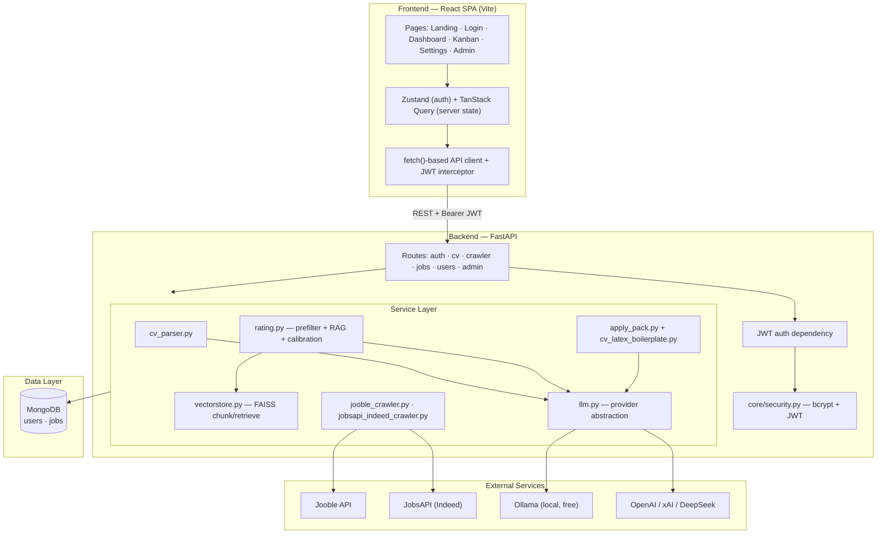
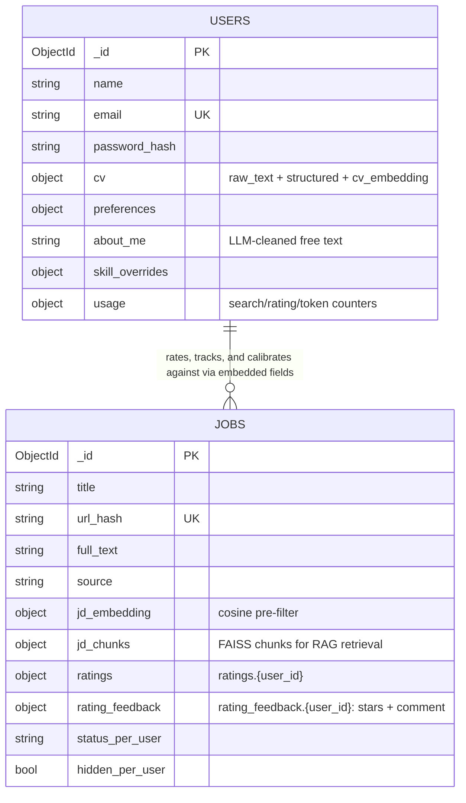
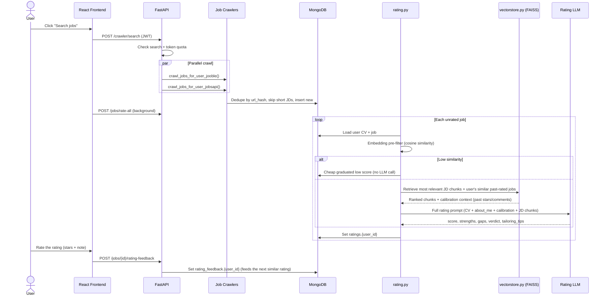

# JobRadar AI

An AI-powered job hunting assistant. Upload your CV, set your preferences, hit **Search jobs**, and JobRadar crawls listings, rates each one against your profile (1–10) with strengths/gaps/tailoring tips, learns from the star ratings and notes you leave on its own ratings, and keeps your applications on a Kanban board.

---

## What You Built

**JobRadar AI** is a full-stack web app with two parts:

| Layer | Tech | Role |
|-------|------|------|
| **Backend** | FastAPI, Motor (MongoDB), LangChain, FAISS, PyMuPDF | Auth, CV parsing, job crawling, AI rating + calibration, REST API |
| **Frontend** | React 18, TypeScript, Vite, TanStack Query, Zustand, @dnd-kit | Landing page, dashboard, drag-and-drop Kanban, settings |

The rating engine isn't a one-shot prompt: a cosine-similarity pre-filter skips the LLM entirely for obvious mismatches, FAISS retrieves the most relevant JD chunks instead of truncating long postings, and every rating you correct with a star + note gets pulled back in as calibration context the next time a similar job shows up.

---

## System Architecture

### High-Level Overview

A React SPA talks to a FastAPI backend, which orchestrates MongoDB persistence, two job-board APIs, and a **split LLM provider** setup via LangChain — one model for CV parsing/apply-pack generation, a separate (often cheaper/faster) model for bulk job rating, controlled entirely through `.env`.



### Data Model

Jobs live in one shared collection; per-user data (ratings, feedback, Kanban status, hidden flag) is embedded on each job document keyed by `{user_id}`, so multiple users can independently rate the same listing without duplicating it.



**`ratings.{user_id}`**: `score`, `matched_strengths`, `gaps`, `verdict`, `auto_reject`, `structural_mismatch`, `tailoring_tips`, `rated_at`.

**`rating_feedback.{user_id}`**: `stars` (1-5), `comment` (LLM-cleaned), `created_at` — surfaced back into the rating prompt the next time a similar job is rated.

**`status_{user_id}`**: `NEW` → `SAVED` → `HALF_APPLIED` → `APPLIED` → `FOLLOWUP` → `INTERVIEWING` → `OFFER` / `REJECTED`.

### Sequence: Job Discovery, Rating & Calibration



---

## How It Works

### 1. Authentication
Email + password, bcrypt-hashed, JWT sessions (7-day expiry, `token_version` invalidates old tokens after a password change). Every protected route resolves the user from the Bearer token.

### 2. CV Upload & Parsing
PyMuPDF extracts raw text from the uploaded PDF (max 5MB, no API call). Contact details (email/phone) are redacted before the text goes to the LLM; the LLM returns structured JSON (skills, experience, projects, education); the real contact info is spliced back in locally. Both raw text and structured data are saved on the user document.

### 3. Preferences & About Me
Settings captures target roles, locations, experience level, work mode, salary floor, key skills, work authorization, and a free-text `about_me`. `about_me` and rating-feedback comments are run through an LLM cleanup pass on save (`services/text_cleanup.py`) — tidies messy free text into clear prose, falls back to the raw text if the LLM call fails.

### 4. Job Discovery
`POST /crawler/search` runs **Jooble** and **JobsAPI (Indeed)** in parallel — the only two crawlers currently wired into the live endpoint. Every job is deduplicated by SHA-256 of its URL, scoped per user. You can also paste a job description directly (**Paste JD**) via URL-fetch or manual text.

### 5. AI Rating — prefilter, RAG, and calibration
- **Cosine pre-filter**: low-similarity jobs get a cheap graduated score (1-4), no LLM call.
- **RAG chunk retrieval** (`services/vectorstore.py`): long JDs are chunked and FAISS retrieves the chunks most relevant to the candidate, instead of naive truncation losing tail content.
- **Calibration**: the user's own past-rated similar jobs (including any star rating + comment they left) are retrieved and injected into the prompt, so the LLM stays consistent with corrections made before.
- **Structured output**: `JobRating` Pydantic model — `score`, `matched_strengths`, `gaps`, `structural_mismatch`, `verdict`, `auto_reject`, `tailoring_tips`.
- **Rate the rating**: every job's detail view has an always-visible star (1-5) + comment panel, feeding directly into the calibration loop above.

### 6. Apply Packs (premium)
For jobs scoring 6+, `GET /jobs/{id}/apply-pack` generates ATS keyword matching, Google XYZ-format bullets (only where a real metric exists in the CV — never invented), a tailored cover-note opener, and a full one-shot prompt + LaTeX CV boilerplate you paste into ChatGPT/Claude/Grok to produce a compilable, tailored CV. Gated by score, daily quota, and AI token quota.

### 7. Freemium & Admin
Three-layer quota, enforced server-side with atomic Mongo increments: searches (default 3/day), ratings (10/day, reserved before the LLM call and refunded on failure), AI tokens (250k/day). Admin panel (`/{ADMIN_SECRET_PATH}/`) lists users, sets per-user overrides, grants temporary/permanent full access, and shows a platform-wide AI cost summary. Admin bypasses all limits.

### 8. Kanban & Freshness
Each job carries a per-user pipeline status. Dashboard shows relative post/crawl time ("2d ago"); Kanban gives desktop drag-and-drop and a mobile tabbed view.

### 9. Privacy & Data Rights
Settings → Data & privacy: a live inventory of what's stored, a full JSON export (`GET /users/data-export`), CV-only deletion, and full account deletion (hard delete of the user doc + every job they crawled, password re-entry required). The Privacy Policy names every third party data actually goes to (Jooble, JobsAPI, your configured LLM provider, MongoDB) and states retention/rights. **Not legal advice** — known gaps: no formal DPA on file with the LLM provider, no automatic data-retention expiry (data persists until the user deletes their account).

---

## Project Structure

```
JobRadar/
├── backend/
│   ├── main.py                        # FastAPI app, scheduler, LangSmith wiring
│   ├── config.py                      # Env settings — LLM providers, quotas, JWT
│   ├── database.py                    # MongoDB connection (Motor)
│   ├── deps.py                        # JWT auth dependency
│   ├── core/security.py               # bcrypt + JWT
│   ├── models/user.py                 # Auth-related Pydantic schemas
│   ├── routes/
│   │   ├── auth.py                    # Register, login, password reset
│   │   ├── cv.py                      # Upload / get / delete CV
│   │   ├── crawler.py                 # Manual search, crawl status
│   │   ├── jobs.py                    # List, rate, rating-feedback, apply-pack, cleanup
│   │   ├── users.py                   # Preferences, skill overrides, data export/deletion
│   │   └── admin.py                   # Secret-path admin panel
│   └── services/
│       ├── llm.py                     # Main + rating LLM split (ollama/openai/xai/deepseek)
│       ├── cv_parser.py                # PDF → text → structured JSON, PII redaction
│       ├── rating.py                  # Prefilter + RAG + calibration + brief/roast
│       ├── vectorstore.py             # FAISS chunking/embedding/retrieval helpers
│       ├── text_cleanup.py            # LLM cleanup for about_me / feedback text
│       ├── apply_pack.py              # ATS keywords, XYZ bullets, one-shot prompt
│       ├── cv_latex_boilerplate.py    # Compilable LaTeX CV template
│       ├── job_dedup.py               # URL hashing + content-fingerprint dedup
│       ├── jd_text.py                 # Incomplete-JD detection, URL enrichment
│       ├── url_fetch.py               # SSRF-safe server-side JD URL fetch
│       ├── limits.py                  # Search/rating/token quotas + admin overrides
│       ├── ai_usage.py                # Per-user token tracking + platform summary
│       ├── scheduler.py               # Auto crawl + rate (respects limits)
│       ├── email.py / job_reminders.py
│       ├── jooble_crawler.py
│       └── jobsapi_indeed_crawler.py
├── frontend/
│   └── src/
│       ├── pages/
│       │   ├── Landing.tsx / Login.tsx / ForgotPassword.tsx / ResetPassword.tsx
│       │   ├── Dashboard.tsx          # Jobs, quotas, search, rate, Paste JD
│       │   ├── Kanban.tsx
│       │   ├── Settings.tsx           # CV, preferences, privacy, skill overrides
│       │   ├── Admin.tsx
│       │   └── Privacy.tsx / Terms.tsx
│       ├── components/
│       │   ├── JobCard.tsx / JobDetailModal.tsx / ScoreBadge.tsx / StarRating.tsx
│       │   ├── ManualJDModal.tsx / WelcomeModal.tsx / LimitContactModal.tsx
│       │   ├── ProgressBar.tsx / StatTile.tsx      # shared dashboard/admin primitives
│       │   └── Navbar.tsx / AuthPageShell.tsx / ThemeToggle.tsx / Logo.tsx
│       └── api/                       # fetch-based client + API helpers
├── README.md
└── handoff.md                         # Dev handoff — session log, ops notes
```

---

## API Overview

| Method | Endpoint | Purpose |
|--------|----------|---------|
| POST | `/auth/register` / `/auth/login` | Create account / log in, get JWT |
| POST | `/auth/forgot-password` / `/auth/reset-password` | Password reset flow (no email enumeration) |
| POST | `/auth/change-password` | Change password while logged in |
| GET | `/auth/me` | Current user profile |
| POST/GET/DELETE | `/cv/upload`, `/cv/me` | Upload, fetch, delete parsed CV |
| GET/PATCH | `/users/preferences` | Get/update search preferences + about_me |
| POST/GET/DELETE | `/users/skill-overrides[/{skill}]` | Per-skill candidate knowledge overrides |
| GET | `/users/data-summary` / `/users/data-export` | What's stored / full JSON export |
| DELETE | `/users/account` | Permanently delete account + all jobs |
| POST | `/crawler/search` | Run job discovery (Jooble + JobsAPI) |
| GET | `/crawler/status` | Crawl stats + quota fields |
| GET | `/jobs` | List jobs (filters; `kanban=true` for pipeline board) |
| POST | `/jobs/rate-all` | Rate all unrated jobs (background) |
| POST | `/jobs/{id}/rate` | Re-rate a single job |
| POST | `/jobs/{id}/rating-feedback` | Star rating (1-5) + comment on a job's AI rating |
| POST | `/jobs/manual` | Add & rate a pasted JD |
| POST | `/jobs/fetch-url` | Server-side JD URL fetch (SSRF-guarded) |
| GET | `/jobs/{id}/brief` | Fit-summary export |
| GET | `/jobs/{id}/apply-pack` | ATS keywords, XYZ bullets, LaTeX CV one-shot prompt |
| PATCH | `/jobs/{id}/status` | Update Kanban status |
| POST/DELETE | `/jobs/cleanup/preview`, `/jobs/cleanup` | Preview/delete jobs by filter (current user) |
| GET/PATCH/DELETE | `/{ADMIN_SECRET_PATH}/users[...]` | List, adjust access/limits, suspend/delete users |
| GET | `/{ADMIN_SECRET_PATH}/ai-summary` | Platform-wide AI token/cost summary |
| POST | `/{ADMIN_SECRET_PATH}/jobs/cleanup` | Admin: delete jobs for any user, scoped to `crawled_by` |

---

## Getting Started

### Prerequisites
- Python 3.11+, Node.js 18+
- MongoDB (local, VPS with auth, or Atlas)
- Ollama running locally, or an API key for OpenAI / xAI / DeepSeek
- Jooble + JobsAPI API keys (for job search)

### Backend
```bash
cd backend
cp .env.example .env
# Edit .env with your Mongo URI, JWT secret, API keys, LLM settings

uv sync
uvicorn main:app --reload
```
API runs at `http://localhost:8000`. `backend/test_llms.py` and `backend/test_rag.py` test the LLM/RAG pieces directly, bypassing the app.

### Frontend
```bash
cd frontend
npm install
npm run dev      # :5173
npm run build     # tsc + vite build
```

### Environment Variables
Everything is `.env`-driven — no model names are hardcoded. See `backend/.env.example` for the full list; key ones:

| Variable | Purpose |
|----------|---------|
| `MONGO_URI` / `MONGO_HOST`+`MONGO_USER`+`MONGO_PASSWORD` | Connection (local, VPS-auth, or Atlas) |
| `LLM_PROVIDER` | `ollama`, `openai`, `xai`, or `deepseek` — main LLM (CV parsing, apply packs) |
| `RATING_PROVIDER` / `RATING_MODEL` | Separate provider/model for bulk rating — e.g. run rating for free on local Ollama (`qwen3:8b`) while CV parsing stays on a hosted model |
| `DEEPSEEK_API_KEY` / `DEEPSEEK_MODEL` | Cheap OpenAI-compatible provider option |
| `XAI_API_KEY` / `GROK_API_KEY` | For xAI/Grok |
| `JWT_SECRET` | **Required in production** — refuses to start with `DEBUG=false` if weak/default |
| `ADMIN_EMAIL` / `ADMIN_SECRET_PATH` | Required to access the admin panel |
| `FREE_SEARCH_LIMIT` / `FREE_RATING_LIMIT` / `FREE_DAILY_TOKEN_LIMIT` | Freemium caps (defaults: 3 / 10 / 250k) |
| `LANGSMITH_TRACING` / `LANGSMITH_API_KEY` / `LANGSMITH_PROJECT` | Optional per-call LLM tracing (prompt/response/latency/errors) |
| `JOOBLE_API_KEY` / `JOBSAPI_KEY` | Job sources |
| `SMTP_*` | Optional — password reset + job reminder emails |

---

## Security

Intentional protections already in place: bcrypt password hashing, JWT with `token_version` invalidation, in-memory brute-force rate limiting on auth routes, all job routes scoped to `crawled_by == current user` (no IDOR), server-side admin email check, no email-enumeration on forgot-password, account deletion requires password re-entry, SSRF-guarded server-side URL fetch, atomic Mongo quota increments, `/docs` disabled when `DEBUG=false`, `.env` gitignored.

**Known risks to be aware of**: CV text and job descriptions are sent to whichever external LLM provider you configure (OpenAI/xAI/DeepSeek) — contact details are redacted first, but the rest of the CV isn't; use local Ollama if that matters for your users. JWT lives in `localStorage` (XSS risk, standard SPA tradeoff). Rate limits are in-memory and don't span restarts or multiple workers — add nginx/Cloudflare rate limiting for a public deployment. See the Privacy Policy (`frontend/src/pages/Privacy.tsx`) for the current data-flow disclosure, and `handoff.md` for the full GDPR-posture audit and its open items (no formal DPA with the LLM provider, no data-retention TTL).

---

## Tech Stack

| Category | Technologies |
|----------|--------------|
| **Language & runtime** | Python 3.11+ (backend), TypeScript (frontend) |
| **Backend framework** | FastAPI, Uvicorn, Pydantic v2, pydantic-settings |
| **Auth & security** | bcrypt, PyJWT, email-validator |
| **Database** | MongoDB, Motor (async driver) |
| **AI / LLM** | LangChain, langchain-ollama, langchain-openai, langchain-xai, langchain-community, FAISS (RAG chunk retrieval), LangSmith (call tracing), structured Pydantic output |
| **LLM providers** | Ollama, OpenAI, xAI (Grok), or DeepSeek — main LLM and rating LLM configured independently |
| **PDF processing** | PyMuPDF (`fitz`) |
| **Job discovery** | Jooble API, JobsAPI (Indeed) |
| **Scheduling** | APScheduler |
| **Frontend framework** | React 18, Vite 5, React Router 6 |
| **Frontend state & data** | TanStack Query, Zustand, native `fetch` |
| **Frontend UI** | Hand-rolled CSS design system (spacing/type/radius tokens, light+dark), Lucide React icons, react-hot-toast, @dnd-kit (Kanban drag-and-drop) |
| **Dev tooling** | uv (Python), npm, Ruff (lint), Prettier |
