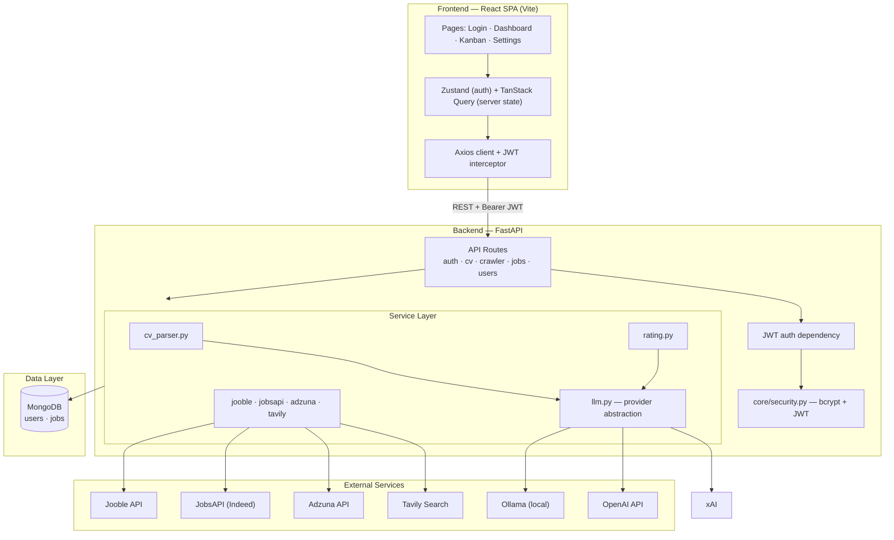
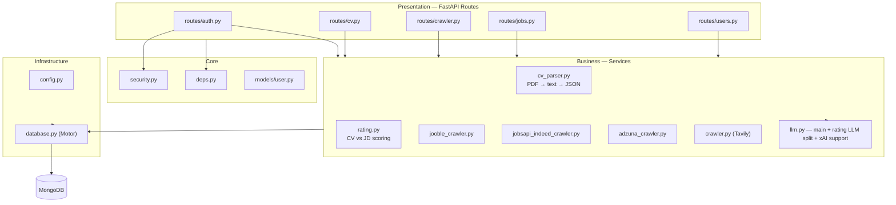
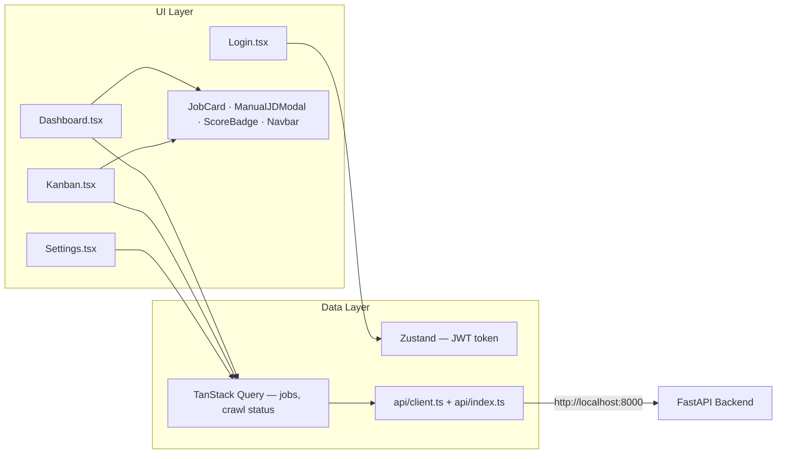
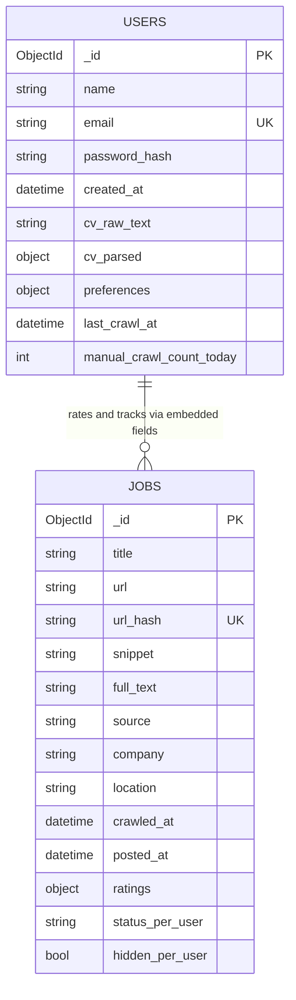
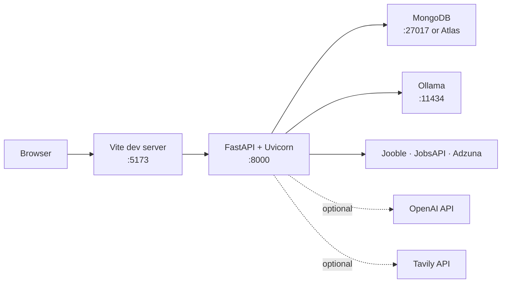
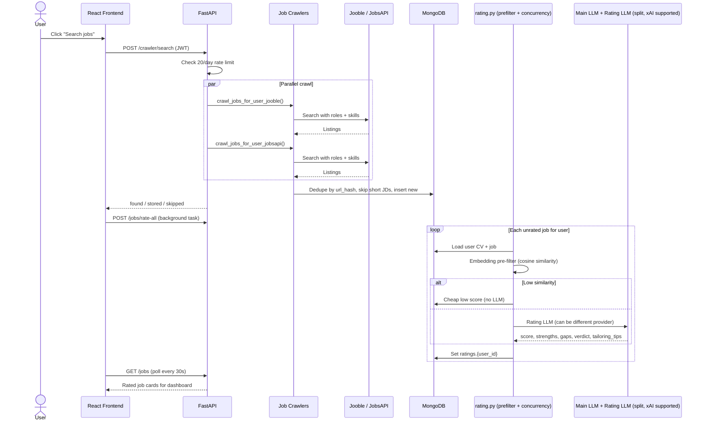
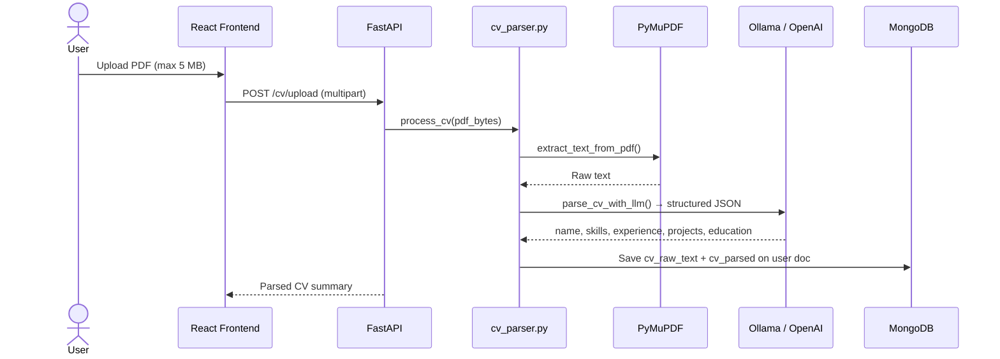
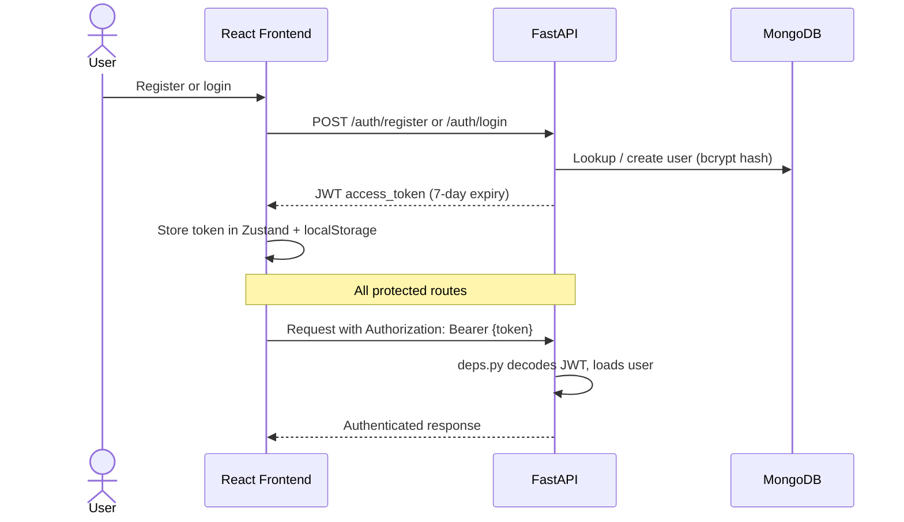

# JobRadar AI

An AI-powered job hunting assistant that finds roles for you, rates them intelligently against your CV (with separate fast rating models), shows when jobs were posted, and helps you track applications — with built-in freemium limits and an admin panel.

---

## What You Built

**JobRadar AI** is a full-stack web app with two parts:

| Layer | Tech | Role |
|-------|------|------|
| **Backend** | FastAPI, Motor (MongoDB), LangChain, LangSmith, PyMuPDF | Auth, CV parsing, job crawling, AI rating, REST API |
| **Frontend** | React 18, TypeScript, Vite, TanStack Query, Zustand, @dnd-kit, Tailwind CSS | Login, job dashboard, drag-and-drop Kanban, settings |

The core idea: upload your CV once, set your preferences, hit **Search jobs**, and the system discovers listings, rates each one against your profile (1–10), and gives you strengths, gaps, and a verdict — so you spend time on roles that actually fit.

---

## System Architecture

### High-Level Overview

JobRadar is a three-tier system: a React SPA talks to a FastAPI backend, which orchestrates MongoDB persistence, external job APIs, and **split LLM providers** via LangChain.

You can use one model/provider for CV parsing and briefs, and a different (usually faster/cheaper) model for bulk job rating. xAI/Grok is fully supported for rating.



### Backend Layered Architecture

The backend follows a thin-routes, fat-services pattern. Routes handle HTTP concerns; services own business logic; `llm.py` abstracts the AI providers.

A key design: **main LLM** (for CV parsing, briefs) vs **rating LLM** (for fast bulk job scoring). They can use completely different providers/models controlled only via `.env`.



### Frontend Architecture



### Data Model

Jobs are stored in a shared collection; per-user data (ratings, Kanban status, hidden flag) is embedded on each job document using `{user_id}` keys. This lets multiple users rate the same listing independently without duplicating job records.



**`ratings.{user_id}`** stores `score`, `matched_strengths`, `gaps`, `verdict`, `auto_reject`, `rated_at`.

**`status_{user_id}`** tracks Kanban pipeline: `NEW` → `SAVED` → `HALF_APPLIED` → `APPLIED` → `FOLLOWUP` → `INTERVIEWING` → `OFFER` / `REJECTED`.

### Deployment Topology



### Sequence: Job Discovery & AI Rating



### Sequence: CV Upload & Parsing



### Sequence: Authentication



---

## How It Works (End-to-End Flow)

```mermaid
flowchart LR
    A[Register / Login] --> B[Upload CV PDF]
    B --> C[LLM parses CV to JSON]
    C --> D[Set preferences in Settings]
    D --> E[Search jobs]
    E --> F[Jooble + JobsAPI]
    F --> G[Store jobs in MongoDB]
    G --> H[Pre-filter + Rating LLM (split model) rates jobs]
    H --> I[Dashboard (with posted date) + Kanban + usage pills]
```

### 1. Authentication

- Users register and log in with email + password.
- Passwords are hashed with bcrypt; sessions use JWT (7-day expiry).
- Every protected route reads the Bearer token and loads the user from MongoDB.
- One account per email (enforced with a unique index).

### 2. CV Upload & Parsing

When you upload a PDF (max 5MB):

1. **PyMuPDF** extracts raw text from the PDF (no API call).
2. **LangChain LLM** turns that text into structured JSON: name, skills, experience, projects, education, etc.
3. Both raw text and structured data are saved on your user document in MongoDB.

The structured CV is what the rating engine uses later.

### 3. User Preferences

In **Settings**, you configure:

- Primary role and secondary roles (e.g. Full Stack Developer, AI Engineer)
- Preferred locations (e.g. Dublin Ireland)
- Job types: full-time, internship, contract, remote
- Key skills (used to build search queries)
- Minimum salary

These preferences drive how job searches are built for you.

### 4. Job Discovery (Crawlers)

Manual search (`POST /crawler/search`) runs **two APIs in parallel**:

| Source | How it works |
|--------|----------------|
| **Jooble** | POST API; keywords + Dublin, Ireland; jobs from last 7 days; fetches full JD from link if snippet is short |
| **JobsAPI (Indeed)** | GET API; searches by role + skills; returns structured title, company, location, salary, description |

**Adzuna** is also implemented (`adzuna_crawler.py`) but currently disabled in the live search endpoint.

**Shared logic for all crawlers:**

- Build search terms from your roles and skills
- Hash each job URL (SHA-256) for deduplication
- Skip jobs already in the database
- Skip listings with too little text (< 100–300 chars depending on source)
- Store: title, URL, company, location, full JD text, source, timestamp

There is also a **Tavily-based crawler** (`services/crawler.py`) that uses web search with personalised dork-style queries. It is implemented but the live search endpoint currently uses Jooble + Adzuna.

**Rate limit:** 20 manual searches per user per day.

### 5. AI Job Rating (LangChain + Performance)

After new jobs are stored, the frontend triggers `POST /jobs/rate-all` in the background.

The rating engine has several optimizations for speed and cost:

- **Embedding pre-filter**: Computes cosine similarity between your CV and each job. Low-similarity jobs get a cheap score (1-4) instantly with **no LLM call**.
- **Split LLMs**: You can use a fast/cheap model (e.g. xAI Grok) **only for rating**, while keeping another model for CV parsing and briefs.
- **Concurrency**: Up to 10 jobs rated in parallel.
- **Structured output**: Uses `JobRating` Pydantic model for reliable JSON.

**Rating fields** (returned by the rating LLM):

| Field | Meaning |
|-------|---------|
| `score` | 1–10 fit score (honest, not inflated) |
| `matched_strengths` | Specific ways your profile matches the JD |
| `gaps` | Requirements you are missing or weak on |
| `verdict` | One-sentence summary + actionable suggestion |
| `auto_reject` | True if there are hard blockers (visa, location, etc.) |
| `tailoring_tips` | Concrete advice on what to emphasize when applying |

Ratings are stored per user (`ratings.{user_id}`).

**Configuration** (all via `.env` only):
- `LLM_PROVIDER` + `OPENAI_MODEL` / `OLLAMA_MODEL` (main LLM)
- `RATING_PROVIDER` + `RATING_MODEL` (can be `xai` + a fast Grok model)
- Full xAI support (native or OpenAI-compatible fallback)

### 6. Manual Job Entry

You can paste a job description directly (**Paste JD** on the dashboard). It is stored with `source: manual`, rated immediately, and appears in your list like any other job.

### 7. Job Brief Export

For rated jobs, **Copy details** generates a formatted brief including:
- Score, matched strengths, gaps, verdict
- Actionable **tailoring tips** (new)
- Snapshot of your profile + constraints
- JD excerpt

### 8. Admin Panel & Freemium Limits

JobRadar includes a built-in freemium system:

- Daily limits on searches and ratings (configurable via `FREE_SEARCH_LIMIT` / `FREE_RATING_LIMIT`)
- Full admin panel available at a secret URL path (`ADMIN_SECRET_PATH`)
- Admins can:
  - View all users and their usage
  - Grant/revoke full access
  - Give temporary full access (12 hours or 1 day)
- Users with full access see "Unlimited"

Limits reset daily. The admin email is also defined in `.env`.

### 9. Job Freshness

Job cards now show **when the job was posted** (or first seen) using relative time (e.g. "2d ago", "5h ago").

This uses `posted_at` when the source provides it, falling back to `crawled_at`.

### 10. Application Tracking

Each user has their own Kanban status per job (`status_{user_id}`):

`NEW` → `SAVED` → `HALF_APPLIED` → `APPLIED` → `FOLLOWUP` → `INTERVIEWING` → `OFFER` / `REJECTED`

- **Dashboard:** card grid with score filters, status filters, text search, pagination, and a reminder when high-scoring jobs sit unapplied
- **Kanban:** drag-style columns to move jobs through your pipeline

---

## Project Structure

```
langchain-jobradar/
├── backend/
│   ├── main.py              # FastAPI app entry point
│   ├── config.py            # Env-based settings (LLM, Mongo, JWT, APIs)
│   ├── database.py          # MongoDB connection
│   ├── deps.py              # JWT auth dependency
│   ├── core/security.py     # Password hashing, JWT create/decode
│   ├── models/user.py       # Pydantic request/response schemas
│   ├── routes/
│   │   ├── auth.py          # Register, login, me
│   │   ├── cv.py            # Upload, get, delete CV
│   │   ├── crawler.py       # Manual search, crawl status
│   │   ├── jobs.py          # List, rate-all, manual JD, brief, status
│   │   ├── admin.py         # Secret-path admin (users, access grants)
│   │   └── users.py         # Preferences
│   └── services/
│       ├── llm.py           # Main LLM + Rating LLM split + xAI support
│       ├── cv_parser.py     # PDF → text → structured JSON
│       ├── rating.py        # CV vs JD scoring + pre-filter + briefs + tailoring tips
│       ├── limits.py        # Freemium limits + admin overrides
│       ├── scheduler.py     # Auto crawl + rate
│       ├── adzuna_crawler.py
│       ├── jooble_crawler.py
│       ├── jobsapi_indeed_crawler.py
│       └── crawler.py       # Tavily-based discovery (alternate)
└── frontend/
    └── src/
        ├── pages/
        │   ├── Login.tsx
        │   ├── Dashboard.tsx    # Job list, search, filters
        │   ├── Kanban.tsx       # Pipeline board
        │   └── Settings.tsx     # CV + preferences
        ├── components/
        │   ├── JobCard.tsx
        │   ├── ScoreBadge.tsx
        │   └── ManualJDModal.tsx
        └── api/                 # Axios client + API helpers
```

---

## API Overview

| Method | Endpoint | Purpose |
|--------|----------|---------|
| POST | `/auth/register` | Create account, get JWT |
| POST | `/auth/login` | Login, get JWT |
| GET | `/auth/me` | Current user profile |
| POST | `/cv/upload` | Upload & parse PDF CV |
| GET | `/cv/me` | Get parsed CV |
| PATCH | `/users/preferences` | Update search preferences |
| POST | `/crawler/search` | Run job discovery |
| GET | `/crawler/status` | Crawl stats & limits |
| GET | `/jobs` | List jobs (filter by score, status, search) |
| POST | `/jobs/rate-all` | Rate all unrated jobs (background, with pre-filter) |
| POST | `/jobs/manual` | Add & rate a pasted JD |
| GET | `/jobs/{id}/brief` | Export job brief (now includes tailoring tips) |
| PATCH | `/jobs/{id}/status` | Update Kanban status |
| GET | `/{ADMIN_SECRET_PATH}/admin` | Admin panel (users, usage, grants) |

---

## Getting Started

### Prerequisites

- Python 3.11+
- Node.js 18+
- MongoDB (local or Atlas)
- Ollama running locally (or OpenAI API key)
- Jooble + JobsAPI API keys (for job search)

### Backend

```bash
cd backend
cp .env.example .env
# Edit .env with your Mongo URI, JWT secret, API keys, LLM settings

uv sync
uvicorn main:app --reload
```

API runs at `http://localhost:8000`.

**Useful for development**:
- `backend/test_llms.py` — test your main LLM and rating LLM directly (bypasses the app)
- `handoff.md` — detailed development notes and issue history from recent work

### Frontend

```bash
cd frontend
npm install
npm run dev
```

App runs at `http://localhost:5173`.

### Environment Variables

**Everything is configured via `.env`** — no model names are hardcoded.

See `backend/.env.example`. Important variables:

| Variable | Purpose |
|----------|---------|
| `LLM_PROVIDER` | `ollama`, `openai`, or `xai` |
| `OPENAI_MODEL` / `OLLAMA_MODEL` | Model for CV parsing, briefs, etc. |
| `RATING_PROVIDER` | Separate provider for job rating (`xai` recommended for speed) |
| `RATING_MODEL` | Model used only for rating (e.g. fast Grok model) |
| `XAI_API_KEY` / `GROK_API_KEY` | For xAI rating |
| `OPENAI_API_KEY` | For main LLM + embeddings |
| `ADMIN_EMAIL` | Admin account email |
| `ADMIN_SECRET_PATH` | Random string for admin URL (e.g. `k9x7p2mQvL4r`) |
| `FREE_SEARCH_LIMIT` / `FREE_RATING_LIMIT` | Daily limits for free users |
| `JOOBLE_API_KEY`, `JOBSAPI_KEY`, etc. | Job sources |

**Key principle**: Change providers/models only in `.env`. The code stays the same.

---

## Summary (TL;DR)

**JobRadar AI** — personalised job search with smart, fast AI rating:

1. Upload CV → structured parsing
2. Set preferences
3. Search jobs (Jooble + JobsAPI + others)
4. **Rate-all** → Uses embedding pre-filter + separate fast rating model (xAI supported) for hundreds of jobs
5. Get scores + **tailoring tips** + track in Kanban
6. Admin panel for limits & access control

**Major current capabilities**:
- Separate main LLM vs Rating LLM (configurable in `.env` only)
- Fast bulk rating via cosine pre-filter + concurrency
- Freemium daily limits + powerful admin grants (incl. temporary full access)
- Job posted date shown on cards
- Clean usage display with "Unlimited" state

The system is deliberately **.env-driven** — no model names or providers are hardcoded in code.

---

## Tech Stack

| Category | Technologies |
|----------|--------------|
| **Language & runtime** | Python 3.11+ (backend), TypeScript (frontend) |
| **Backend framework** | FastAPI, Uvicorn, Pydantic v2, pydantic-settings, python-dotenv |
| **Auth & security** | bcrypt, PyJWT, email-validator |
| **Database** | MongoDB, Motor (async driver) |
| **AI / LLM** | LangChain, langchain-ollama, langchain-openai, langchain-xai, LangSmith (tracing), structured Pydantic output |
| **LLM providers** | Ollama, OpenAI, or xAI (Grok). Main LLM and Rating LLM can be different. |
| **PDF processing** | PyMuPDF (`fitz`) |
| **Job discovery** | Jooble API, JobsAPI (Indeed), Adzuna, Tavily Python SDK |
| **HTTP client** | httpx (async crawlers) |
| **Scheduling** | APScheduler |
| **Frontend framework** | React 18, Vite 5, React Router 6 |
| **Frontend state & data** | TanStack Query, Zustand, Axios |
| **Frontend UI** | Tailwind CSS, Lucide React (icons), react-hot-toast (notifications), @dnd-kit (Kanban drag-and-drop) |
| **Dev tooling** | uv (Python package manager), npm, Ruff (linting) |