# JobRadar AI

An AI-powered job hunting assistant that finds roles for you, scores how well each job fits your CV, and helps you track applications from discovery to offer.

---

## What You Built

**JobRadar AI** is a full-stack web app with two parts:

| Layer | Tech | Role |
|-------|------|------|
| **Backend** | FastAPI, MongoDB, LangChain | Auth, CV parsing, job crawling, AI rating, API |
| **Frontend** | React, Vite, TanStack Query, Zustand | Login, job dashboard, Kanban board, settings |

The core idea: upload your CV once, set your preferences, hit **Search jobs**, and the system discovers listings, rates each one against your profile (1–10), and gives you strengths, gaps, and a verdict — so you spend time on roles that actually fit.

---

## How It Works (End-to-End Flow)

```mermaid
flowchart LR
    A[Register / Login] --> B[Upload CV PDF]
    B --> C[LLM parses CV to JSON]
    C --> D[Set preferences in Settings]
    D --> E[Search jobs]
    E --> F[Adzuna + Jooble APIs]
    F --> G[Store jobs in MongoDB]
    G --> H[LLM rates CV vs each JD]
    H --> I[Dashboard + Kanban]
```



### 1. Authentication

- Users register and log in with email + password.
- Passwords are hashed with bcrypt; sessions use JWT (7-day expiry).
- Every protected route reads the Bearer token and loads the user from MongoDB.
- One account per email (enforced with a unique index).

### 2. CV Upload & Parsing

When you upload a PDF (max 5MB):

1. **PyMuPDF** extracts raw text from the PDF (no API call).
2. **LangChain LLM** turns that text into structured JSON: name, skills, experience, projects, education, etc.
3. Both raw text and structured data are saved on your user document in MongoDB.

The structured CV is what the rating engine uses later.

### 3. User Preferences

In **Settings**, you configure:

- Primary role and secondary roles (e.g. Full Stack Developer, AI Engineer)
- Preferred locations (e.g. Dublin Ireland)
- Job types: full-time, internship, contract, remote
- Key skills (used to build search queries)
- Minimum salary

These preferences drive how job searches are built for you.

### 4. Job Discovery (Crawlers)

Manual search (`POST /crawler/search`) runs **two APIs in parallel**:

| Source | How it works |
|--------|----------------|
| **Jooble** | POST API; keywords + Dublin, Ireland; jobs from last 7 days; fetches full JD from link if snippet is short |
| **Adzuna** | GET API; Ireland (`ie`); searches by role + skills; returns structured title, company, location, salary, description |

**Shared logic for all crawlers:**

- Build search terms from your roles and skills
- Hash each job URL (SHA-256) for deduplication
- Skip jobs already in the database
- Skip listings with too little text (< 100–300 chars depending on source)
- Store: title, URL, company, location, full JD text, source, timestamp

There is also a **Tavily-based crawler** (`services/crawler.py`) that uses web search with personalised dork-style queries. It is implemented but the live search endpoint currently uses Jooble + Adzuna.

**Rate limit:** 20 manual searches per user per day.

### 5. AI Job Rating (LangChain)

After new jobs are stored, the frontend triggers `POST /jobs/rate-all` in the background.

For each unrated job, the rating service:

1. Builds a CV summary from your structured profile
2. Sends the job description (up to 4,000 chars) + CV to the LLM
3. Uses **LangChain structured output** (`JobRating` Pydantic model) so the response is always valid JSON

**Rating fields:**

| Field | Meaning |
|-------|---------|
| `score` | 1–10 fit score (honest, not inflated) |
| `matched_strengths` | Where your CV aligns with the JD |
| `gaps` | Requirements you are missing or weak on |
| `verdict` | One-sentence summary + actionable suggestion |
| `auto_reject` | True if visa/location/hard skill blockers exist |

Ratings are stored per user on each job document (`ratings.{user_id}`), so the same job can be rated differently for different users.

**LLM provider** is swappable via `.env`: `ollama` (default, local) or `openai`.

### 6. Manual Job Entry

You can paste a job description directly (**Paste JD** on the dashboard). It is stored with `source: manual`, rated immediately, and appears in your list like any other job.

### 7. Job Brief Export

For rated jobs, **Copy details** generates a formatted brief: role, URL, score, strengths, gaps, verdict, your profile snapshot, and a JD excerpt — ready to paste before applying.

### 8. Application Tracking

Each user has their own Kanban status per job (`status_{user_id}`):

`NEW` → `SAVED` → `HALF_APPLIED` → `APPLIED` → `FOLLOWUP` → `INTERVIEWING` → `OFFER` / `REJECTED`

- **Dashboard:** card grid with score filters, status filters, text search, pagination, and a reminder when high-scoring jobs sit unapplied
- **Kanban:** drag-style columns to move jobs through your pipeline

---

## Project Structure

```
langchain-jobradar/
├── backend/
│   ├── main.py              # FastAPI app entry point
│   ├── config.py            # Env-based settings (LLM, Mongo, JWT, APIs)
│   ├── database.py          # MongoDB connection
│   ├── deps.py              # JWT auth dependency
│   ├── core/security.py     # Password hashing, JWT create/decode
│   ├── models/user.py       # Pydantic request/response schemas
│   ├── routes/
│   │   ├── auth.py          # Register, login, me
│   │   ├── cv.py            # Upload, get, delete CV
│   │   ├── crawler.py       # Manual search, crawl status
│   │   ├── jobs.py          # List, rate, manual JD, brief, status
│   │   └── users.py         # Preferences
│   └── services/
│       ├── llm.py           # LangChain LLM + embeddings abstraction
│       ├── cv_parser.py     # PDF → text → structured JSON
│       ├── rating.py        # CV vs JD scoring + job brief
│       ├── adzuna_crawler.py
│       ├── jooble_crawler.py
│       └── crawler.py       # Tavily-based discovery (alternate)
└── frontend/
    └── src/
        ├── pages/
        │   ├── Login.tsx
        │   ├── Dashboard.tsx    # Job list, search, filters
        │   ├── Kanban.tsx       # Pipeline board
        │   └── Settings.tsx     # CV + preferences
        ├── components/
        │   ├── JobCard.tsx
        │   ├── ScoreBadge.tsx
        │   └── ManualJDModal.tsx
        └── api/                 # Axios client + API helpers
```

---

## API Overview

| Method | Endpoint | Purpose |
|--------|----------|---------|
| POST | `/auth/register` | Create account, get JWT |
| POST | `/auth/login` | Login, get JWT |
| GET | `/auth/me` | Current user profile |
| POST | `/cv/upload` | Upload & parse PDF CV |
| GET | `/cv/me` | Get parsed CV |
| PATCH | `/users/preferences` | Update search preferences |
| POST | `/crawler/search` | Run job discovery |
| GET | `/crawler/status` | Crawl stats & limits |
| GET | `/jobs` | List jobs (filter by score, status, search) |
| POST | `/jobs/rate-all` | Rate all unrated jobs (background) |
| POST | `/jobs/manual` | Add & rate a pasted JD |
| GET | `/jobs/{id}/brief` | Export job brief |
| PATCH | `/jobs/{id}/status` | Update Kanban status |

---

## Getting Started

### Prerequisites

- Python 3.11+
- Node.js 18+
- MongoDB (local or Atlas)
- Ollama running locally (or OpenAI API key)
- Adzuna + Jooble API keys (for job search)

### Backend

```bash
cd backend
cp .env.example .env
# Edit .env with your Mongo URI, JWT secret, API keys, LLM settings

uv sync
uvicorn main:app --reload
```

API runs at `http://localhost:8000`.

### Frontend

```bash
cd frontend
npm install
npm run dev
```

App runs at `http://localhost:5173`.

### Environment Variables

See `backend/.env.example`. Key ones:

| Variable | Purpose |
|----------|---------|
| `MONGO_URI` | MongoDB connection string |
| `JWT_SECRET` | Token signing secret |
| `LLM_PROVIDER` | `ollama` or `openai` |
| `OLLAMA_MODEL` | e.g. `qwen2.5:14b` |
| `ADZUNA_APP_ID` / `ADZUNA_APP_KEY` | Adzuna job API |
| `JOOBLE_API_KEY` | Jooble job API |
| `TAVILY_API_KEY` | Optional, for Tavily crawler |

---

## Summary (TL;DR)

You built **JobRadar AI** — a personalised job search copilot:

1. **Upload your CV** → AI extracts structured skills, experience, and projects.
2. **Set preferences** → roles, locations, job types, key skills.
3. **Search** → Jooble + Adzuna fetch Ireland-focused listings tailored to your profile.
4. **Rate** → LangChain compares each job description to your CV and returns a 1–10 score with strengths, gaps, and a verdict.
5. **Act** → Filter by score, track status on a Kanban board, copy job briefs, paste manual JDs.

The architecture is designed to be **provider-agnostic**: swap `LLM_PROVIDER` in `.env` and the same LangChain code works with Ollama or OpenAI. Job data lives in MongoDB with per-user ratings and statuses, so the system scales to multiple users without mixing their data.

**LangChain is used for:** CV parsing (text → JSON), job-CV fit rating (structured Pydantic output), and optional LangSmith tracing. **PyMuPDF** handles PDF extraction. **FastAPI + React** deliver the API and UI.

---

## Tech Stack

- **Backend:** FastAPI, Motor (async MongoDB), Pydantic, LangChain, PyMuPDF, httpx
- **Frontend:** React 18, TypeScript, Vite, TanStack Query, Zustand, React Router, Tailwind CSS
- **AI:** LangChain (Ollama / OpenAI), structured output for reliable JSON
- **Data:** MongoDB
- **Job APIs:** Adzuna, Jooble (+ Tavily as alternate discovery)