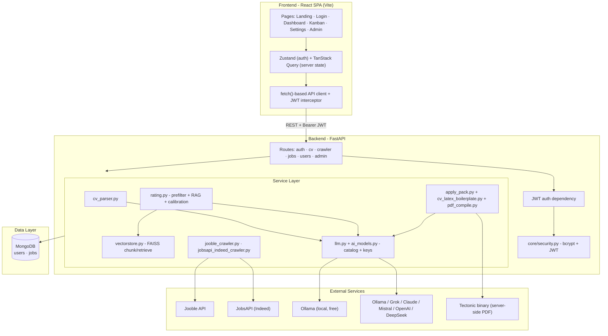
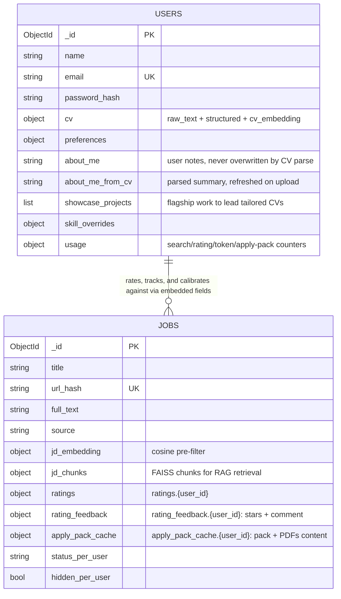
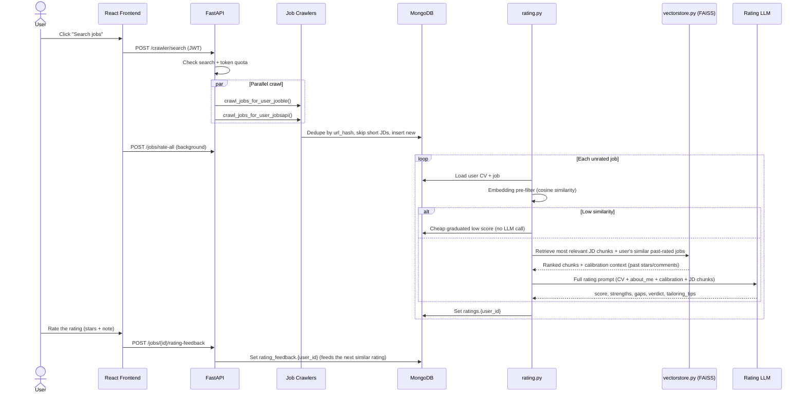

# JobRadar AI

Upload a CV, set the markets you actually want, hit **Search jobs**. JobRadar crawls Jooble and Indeed, scores each listing 1-10 against *that* person's profile (not a generic resume keyword dump), and can download a tailored CV PDF plus cover letter for jobs that are worth applying to.

It learns: star + note a bad rating and similar jobs pick that up. Applications live on a Kanban, not a spreadsheet.

This is a working product for job seekers in any country. Defaults are empty (no Dublin, no one person's stack). Visa/work-auth comes from what the user typed, not from the city they searched.

---

## Stack

**JobRadar AI** is a full-stack web app with two parts:

| Layer | Tech | Role |
|-------|------|------|
| **Backend** | FastAPI, Motor (MongoDB), LangChain, FAISS, PyMuPDF | Auth, CV parsing, job crawling, AI rating + calibration, REST API |
| **Frontend** | React 18, TypeScript, Vite, TanStack Query, Zustand, @dnd-kit | Landing page, dashboard, drag-and-drop Kanban, settings |

The rating engine isn't a one-shot prompt: a cosine-similarity pre-filter skips the LLM entirely for obvious mismatches, FAISS retrieves the most relevant JD chunks instead of truncating long postings, and every rating you correct with a star + note gets pulled back in as calibration context the next time a similar job shows up.

---

## System Architecture

### High-Level Overview

A React SPA talks to a FastAPI backend, which orchestrates MongoDB, two job-board APIs, and a **three-purpose LLM catalog** via LangChain so you can cut cost: cheap/local for bulk rating, stronger for apply-pack CVs, separate for CV parsing. Switch independently in Settings.

Supported providers: **Ollama** (local, free), **Grok (xAI)**, **Anthropic Claude**, Mistral (EU default), OpenAI, DeepSeek. A model only shows if its API key (or Ollama) is on the server. Typical cost split: Ollama for rating hundreds of jobs, Grok or Claude for the few apply-pack PDFs.


```mermaid
flowchart TB
    subgraph Client["Frontend - React SPA (Vite)"]
        Pages["Pages: Landing · Login · Dashboard · Kanban · Settings · Admin"]
        State["Zustand (auth) + TanStack Query (server state)"]
        Fetch["fetch()-based API client + JWT interceptor"]
    end

    subgraph Backend["Backend - FastAPI"]
        Routes["Routes: auth · cv · crawler · jobs · users · admin"]
        Deps["JWT auth dependency"]
        subgraph Services["Service Layer"]
            CVParser["cv_parser.py"]
            Rating["rating.py - prefilter + RAG + calibration"]
            Vectorstore["vectorstore.py - FAISS chunk/retrieve"]
            ApplyPack["apply_pack.py + cv_latex_boilerplate.py + pdf_compile.py"]
            Crawlers["jooble_crawler.py · jobsapi_indeed_crawler.py"]
            LLM["llm.py + ai_models.py - catalog + keys"]
        end
        Security["core/security.py - bcrypt + JWT"]
    end

    subgraph Data["Data Layer"]
        MongoDB[("MongoDB<br/>users · jobs")]
    end

    subgraph External["External Services"]
        Jooble["Jooble API"]
        JobsAPI["JobsAPI (Indeed)"]
        Ollama["Ollama (local, free)"]
        LLMs["Ollama / Grok / Claude / Mistral / OpenAI / DeepSeek"]
        Tectonic["Tectonic binary (server-side PDF)"]
    end

    Pages --> State --> Fetch
    Fetch -->|"REST + Bearer JWT"| Routes
    Routes --> Deps --> Security
    Routes --> Services
    Services --> MongoDB
    CVParser --> LLM
    Rating --> Vectorstore
    Rating --> LLM
    ApplyPack --> LLM
    ApplyPack --> Tectonic
    Crawlers --> Jooble & JobsAPI
    LLM --> Ollama & LLMs
```

### Data Model

Jobs live in one shared MongoDB collection, but are not deduplicated across users - each user's crawl inserts its own job document (scoped by `crawled_by`), even for an identical URL another user already has. Per-user data (ratings, feedback, Kanban status, hidden flag) is embedded on that document keyed by `{user_id}`.


```mermaid
erDiagram
    USERS {
        ObjectId _id PK
        string name
        string email UK
        string password_hash
        object cv "raw_text + structured + cv_embedding"
        object preferences
        string about_me "user notes, never overwritten by CV parse"
        string about_me_from_cv "parsed summary, refreshed on upload"
        list showcase_projects "flagship work to lead tailored CVs"
        object skill_overrides
        object usage "search/rating/token/apply-pack counters"
    }

    JOBS {
        ObjectId _id PK
        string title
        string url_hash UK
        string full_text
        string source
        object jd_embedding "cosine pre-filter"
        object jd_chunks "FAISS chunks for RAG retrieval"
        object ratings "ratings.{user_id}"
        object rating_feedback "rating_feedback.{user_id}: stars + comment"
        object apply_pack_cache "apply_pack_cache.{user_id}: pack + PDFs content"
        string status_per_user
        bool hidden_per_user
    }

    USERS ||--o{ JOBS : "rates, tracks, and calibrates against via embedded fields"
```

**`ratings.{user_id}`**: `score`, `matched_strengths`, `gaps`, `verdict`, `auto_reject`, `structural_mismatch`, `tailoring_tips`, `rated_at`.

**`rating_feedback.{user_id}`**: `stars` (1-5), `comment` (LLM-cleaned), `created_at` - surfaced back into the rating prompt the next time a similar job is rated.

**`status_{user_id}`**: `NEW` → `SAVED` → `HALF_APPLIED` → `APPLIED` → `FOLLOWUP` → `INTERVIEWING` → `OFFER` / `REJECTED`.

### Sequence: Job Discovery, Rating & Calibration


```mermaid
sequenceDiagram
    actor User
    participant FE as React Frontend
    participant API as FastAPI
    participant Crawler as Job Crawlers
    participant DB as MongoDB
    participant Rating as rating.py
    participant Vec as vectorstore.py (FAISS)
    participant LLM as Rating LLM

    User->>FE: Click "Search jobs"
    FE->>API: POST /crawler/search (JWT)
    API->>API: Check search + token quota
    par Parallel crawl
        API->>Crawler: crawl_jobs_for_user_jooble()
        API->>Crawler: crawl_jobs_for_user_jobsapi()
    end
    Crawler->>DB: Dedupe by url_hash, skip short JDs, insert new

    FE->>API: POST /jobs/rate-all (background)
    loop Each unrated job
        Rating->>DB: Load user CV + job
        Rating->>Rating: Embedding pre-filter (cosine similarity)
        alt Low similarity
            Rating->>DB: Cheap graduated low score (no LLM call)
        else
            Rating->>Vec: Retrieve most relevant JD chunks + user's similar past-rated jobs
            Vec-->>Rating: Ranked chunks + calibration context (past stars/comments)
            Rating->>LLM: Full rating prompt (CV + about_me + calibration + JD chunks)
            LLM-->>Rating: score, strengths, gaps, verdict, tailoring_tips
        end
        Rating->>DB: Set ratings.{user_id}
    end

    User->>FE: Rate the rating (stars + note)
    FE->>API: POST /jobs/{id}/rating-feedback
    API->>DB: Set rating_feedback.{user_id} (feeds the next similar rating)
```

---

## How It Works

### 1. Authentication
Email + password, bcrypt-hashed, JWT sessions (7-day expiry, `token_version` invalidates old tokens after a password change). Every protected route resolves the user from the Bearer token.

### 2. CV Upload & Parsing
Accepts PDF, Word (`.docx`), OpenDocument (`.odt`), plain text, and LaTeX (max 5MB, format detected from the file extension since browsers send inconsistent MIME types for the less common ones). PyMuPDF/`python-docx`/`odfpy` extract raw text depending on format, no API call for extraction itself. Contact details (email/phone) are redacted before the text goes to the LLM; the LLM returns structured JSON (skills grouped by category, experience, projects with live-deploy/repo links, education, portfolio/GitHub/LinkedIn links, only ever extracted if actually written in the CV, never invented); the real contact info is spliced back in locally. Both raw text and structured data are saved on the user document. On upload, Settings fields that overlap with the parse (`primary_role`, `preferred_locations`, `key_skills`) are auto-filled. `about_me` (the user's own notes) is never overwritten. A separate `about_me_from_cv` holds the parsed summary and refreshes on each upload. `key_skills` is capped to a short search list (the full categorized CV skills still feed rating). Settings → Flagship work lists parsed projects and jobs so the user can tick what tailored CVs should lead with. Every URL from a CV is validated against a strict http(s) pattern before it goes into a LaTeX `\href{}`.

### 3. Preferences & About Me
Settings (tabs: Profile & CV, AI models, Job search, Notifications, Account, Data & privacy - each tab stamps "cleared" when its required fields are done) captures target roles, locations, experience, work mode, salary floor, key skills, nationality, visa/permit, work authorization, flagship projects, timezone, and `about_me`. Empty location/role prefs do **not** fall back to Dublin or "Full Stack". Timezone defaults to the browser (UTC if missing). `about_me` and rating-feedback comments go through `text_cleanup.py` on save. Nationality + visa status feed sponsorship/visa auto-reject: the LLM reasons per nationality/country pair, no Ireland-only table. Search location is not treated as work authorization (searching Germany does not claim a German visa).

### 4. Job Discovery
`POST /crawler/search` runs **Jooble** and **JobsAPI (Indeed)** in parallel - the only two crawlers currently wired into the live endpoint. Every job is deduplicated by SHA-256 of its URL, scoped per user. You can also paste a job description directly (**Paste JD**) via URL-fetch or manual text.

### 5. AI Rating - prefilter, RAG, and calibration
- **Cosine pre-filter**: low-similarity jobs get a cheap graduated score (1-4), no LLM call.
- **RAG chunk retrieval** (`services/vectorstore.py`): long JDs are chunked and FAISS retrieves the chunks most relevant to the candidate, instead of naive truncation losing tail content.
- **Calibration**: the user's own past-rated similar jobs (including any star rating + comment they left) are retrieved and injected into the prompt, so the LLM stays consistent with corrections made before.
- **Structured output**: `JobRating` Pydantic model - `score`, `matched_strengths`, `gaps`, `structural_mismatch`, `verdict`, `auto_reject`, `tailoring_tips`.
- **Sponsorship/visa reasoning**: the candidate's nationality, visa/permit status, and work authorization are reasoned about together against the job's country and stated sponsorship policy, using the LLM's own general knowledge, no fixed per-country rule table, and auto-rejects with score ≤ 2 when the candidate can't legally work there without sponsorship the JD says isn't offered.
- **Essential-gap score cap**: enforced as a hard post-processing rule (not just a prompt instruction), 2+ gaps tagged `[Essential]` clamps the score to 6 regardless of what the LLM returned, so a listing with multiple must-have skills the candidate is missing can't slip through as a strong match.
- **Rate the rating**: every job's detail view has an always-visible star (1-5) + comment panel, feeding directly into the calibration loop above.

### 6. Apply Packs (premium)
Two ways to turn a rated job into an application, from the job detail view, gated by score (6+), daily quota, and AI token quota:

- **Download apply pack**: streams progress over SSE. First generation is a real three-call loop (draft → independent ATS critique → one revision if ATS found issues). Each LLM call is capped at 5 minutes; if ATS or revision times out, the draft is still cached instead of throwing the wait away. Generation runs in a background task: closing the tab does not cancel it. Come back and the card shows "CV on the way", or Download if it finished. Server compiles CV + cover-letter PDFs with a **Tectonic** binary at `backend/bin/tectonic` (gitignored; install on the VPS, warm `.tectonic_cache/`). No Overleaf on the user side.
  - CV: per-role XYZ bullets only where a real metric exists in that MASTER CV bullet; flagship projects from Settings lead Key Projects when those names exist on the CV; fake measured-by clauses are stripped in code; em dashes are stripped (they read as AI-default).
  - Cover letter: 4 parts (strongest match, concrete examples, Essential gaps named-then-pivoted, specific close). Preferred gaps the JD leans on still get one acknowledgment if a tailoring tip asked for it. Body is real paragraphs, not one run-on sentence.
  - Cache is **not** a 12-hour TTL. It stays until this job is re-rated or the CV is replaced. Rebuild **CV**, **letter**, or **both**, with an optional note ("lead with X, mention AWS as learning"). CV-only / letter-only is one LLM call on the existing pack and does not burn another daily pack. Rebuild both does.
- **Copy apply pack**: zero extra LLM for the handoff doc (fit + MASTER CV + JD + LaTeX boilerplate) to paste into your own ChatGPT/Claude/Grok.

### 7. Freemium & Admin
Four-layer quota, enforced server-side with atomic Mongo increments: searches (default 3/day), ratings (10/day, reserved before the LLM call and refunded on failure), apply packs (1/day free), AI tokens (250k/day). Admin panel (`/{ADMIN_SECRET_PATH}/`) lists users, sets per-user overrides (including separate rating / apply-pack / CV-parse models), grants temporary/permanent full access, and shows a platform-wide AI cost summary. Admin bypasses all limits. Models without an API key on the server are hidden from Settings.

### 8. Kanban & Freshness
Each job carries a per-user pipeline status. Dashboard shows relative post/crawl time ("2d ago"); Kanban gives desktop drag-and-drop and a mobile tabbed view.

### 9. Notifications
A small bell in the navbar, not a full notification history - computed live from signals that already exist rather than a separate stored event log: top matches ready to apply to, stale follow-ups, and new AI models added to the admin-managed catalog since you last checked (`GET /users/notifications`, `POST /users/notifications/seen`).

### 10. Privacy & Data Rights
Settings → Data & privacy: a live inventory of what's stored, a full JSON export (`GET /users/data-export`), CV-only deletion, and full account deletion (hard delete of the user doc + every job they crawled, password re-entry required). The Privacy Policy names every third party data actually goes to (Jooble, JobsAPI, your configured LLM provider, MongoDB) and states retention/rights. CV parsing and job rating default to Mistral, an EU-hosted provider, and the app itself is hosted on EU infrastructure - CV/JD content doesn't leave the EU for processing by default. Users can opt into OpenAI or DeepSeek per model (CV parsing / rating independently) from an admin-managed catalog in Settings; doing so sends that data outside the EU to that provider instead, and is treated as a consent action (confirmed in the UI, timestamped server-side). Server logs auto-rotate within 30 days (`pm2-logrotate`). **Not legal advice** - known gap: no formal DPA on file with any LLM provider.

---

## Project Structure

```
JobRadar/
├── backend/
│   ├── main.py                        # FastAPI app, scheduler, LangSmith wiring
│   ├── config.py                      # Env settings - LLM providers, quotas, JWT
│   ├── database.py                    # MongoDB connection (Motor)
│   ├── deps.py                        # JWT auth dependency
│   ├── core/security.py               # bcrypt + JWT
│   ├── models/user.py                 # Auth-related Pydantic schemas
│   ├── routes/
│   │   ├── auth.py                    # Register, login, password reset
│   │   ├── cv.py                      # Upload / get / delete CV
│   │   ├── crawler.py                 # Manual search, crawl status
│   │   ├── jobs.py                    # List, rate, rating-feedback, apply-pack, cleanup
│   │   ├── users.py                   # Preferences, skill overrides, data export/deletion
│   │   └── admin.py                   # Secret-path admin panel
│   └── services/
│       ├── llm.py                     # Main + rating LLM split (ollama/openai/xai/mistral)
│       ├── cv_parser.py                # PDF → text → structured JSON, PII redaction
│       ├── rating.py                  # Prefilter + RAG + calibration + brief/roast
│       ├── vectorstore.py             # FAISS chunking/embedding/retrieval helpers
│       ├── text_cleanup.py            # LLM cleanup for about_me / feedback text
│       ├── apply_pack.py              # Draft / ATS / revision + partial CV or letter regen
│       ├── cv_latex_boilerplate.py    # LaTeX CV/cover-letter templates, URL validation
│       ├── pdf_compile.py             # Tectonic subprocess wrapper, page-count check
│       ├── ai_models.py               # Admin-managed catalog per purpose (rating/apply_pack/cv_parsing)
│       ├── job_dedup.py               # URL hashing + content-fingerprint dedup
│       ├── jd_text.py                 # Incomplete-JD detection, URL enrichment
│       ├── url_fetch.py               # SSRF-safe server-side JD URL fetch
│       ├── prompt_safety.py           # Fences untrusted JD/CV text before it hits an LLM prompt
│       ├── limits.py                  # Search/rating/token quotas + admin overrides
│       ├── ai_usage.py                # Per-user token tracking + platform summary
│       ├── scheduler.py               # Auto crawl + rate (respects limits)
│       ├── email.py / job_reminders.py
│       ├── jooble_crawler.py
│       └── jobsapi_indeed_crawler.py
├── frontend/
│   └── src/
│       ├── pages/
│       │   ├── Landing.tsx / Login.tsx / ForgotPassword.tsx / ResetPassword.tsx
│       │   ├── Dashboard.tsx          # Jobs, quotas, search, rate, Paste JD
│       │   ├── Kanban.tsx
│       │   ├── Settings.tsx           # CV, flagship work, prefs, privacy, skill overrides
│       │   ├── Admin.tsx
│       │   └── Privacy.tsx / Terms.tsx
│       ├── components/
│       │   ├── JobCard.tsx / JobDetailModal.tsx / ScoreBadge.tsx / StarRating.tsx
│       │   ├── RejectReasonModal.tsx / RadarSweep.tsx
│       │   ├── ManualJDModal.tsx / WelcomeModal.tsx / LimitContactModal.tsx
│       │   ├── ProgressBar.tsx / StatTile.tsx      # shared dashboard/admin primitives
│       │   ├── ui/                    # Button / TextField / Card / ClearanceStamp - shared kit
│       │   └── Navbar.tsx / AuthPageShell.tsx / ThemeToggle.tsx / Logo.tsx
│       ├── utils/profileCompleteness.ts  # Shared "what's still missing" check (Dashboard gating + Settings)
│       └── api/                       # fetch-based client + API helpers
├── README.md
```

---

## API Overview

| Method | Endpoint | Purpose |
|--------|----------|---------|
| POST | `/auth/register` / `/auth/login` | Create account / log in, get JWT |
| POST | `/auth/forgot-password` / `/auth/reset-password` | Password reset flow (no email enumeration) |
| POST | `/auth/change-password` | Change password while logged in |
| GET | `/auth/me` | Current user profile |
| POST/GET/DELETE | `/cv/upload`, `/cv/me` | Upload (PDF/DOCX/ODT/TXT/TeX), fetch, delete parsed CV |
| GET/PATCH | `/users/preferences` | Get/update search preferences + about_me |
| POST/GET/DELETE | `/users/skill-overrides[/{skill}]` | Per-skill candidate knowledge overrides |
| GET | `/users/data-summary` / `/users/data-export` | What's stored / full JSON export |
| GET/POST | `/users/notifications` / `/users/notifications/seen` | Notification bell feed / mark seen |
| DELETE | `/users/account` | Permanently delete account + all jobs |
| POST | `/crawler/search` | Run job discovery (Jooble + JobsAPI) |
| GET | `/crawler/status` | Crawl stats + quota fields |
| GET | `/jobs` | List jobs (filters; `kanban=true` for pipeline board) |
| POST | `/jobs/rate-all` | Rate all unrated jobs (background) |
| POST | `/jobs/{id}/rate` | Re-rate a single job |
| POST | `/jobs/{id}/rating-feedback` | Star rating (1-5) + comment on a job's AI rating |
| POST | `/jobs/manual` | Add & rate a pasted JD |
| POST | `/jobs/fetch-url` | Server-side JD URL fetch (SSRF-guarded) |
| GET | `/jobs/{id}/brief` | Zero-LLM handoff doc (fit summary + CV + JD + LaTeX boilerplate) to paste into your own AI chat |
| GET | `/jobs/{id}/apply-pack` | Generate tailored CV + cover letter (SSE). Cached until re-rate or CV change. `?regenerate=true`, optional `part=cv\|cover` + `note=` |
| GET | `/jobs/{id}/apply-pack/cv.pdf` | Download the compiled tailored CV PDF (requires a prior apply-pack generation) |
| GET | `/jobs/{id}/apply-pack/cover-letter.pdf` | Download the compiled cover-letter PDF |
| PATCH | `/jobs/{id}/status` | Update Kanban status |
| POST/DELETE | `/jobs/cleanup/preview`, `/jobs/cleanup` | Preview/delete jobs by filter (current user) |
| GET/PATCH/DELETE | `/{ADMIN_SECRET_PATH}/users[...]` | List, adjust access/limits, suspend/delete users |
| GET | `/{ADMIN_SECRET_PATH}/ai-summary` | Platform-wide AI token/cost summary |
| POST | `/{ADMIN_SECRET_PATH}/jobs/cleanup` | Admin: delete jobs for any user, scoped to `crawled_by` |

---

## Getting Started

### Prerequisites
- Python 3.11+, Node.js 18+
- MongoDB (local, VPS with auth, or Atlas)
- Ollama running locally, or an API key for Mistral / OpenAI / DeepSeek / xAI
- Jooble + JobsAPI API keys (for job search)
- For PDF downloads on a VPS: Tectonic binary at `backend/bin/tectonic` (not in git). Warm `.tectonic_cache/` once. No TeXLive. See comments in `services/pdf_compile.py`.

### Backend
```bash
cd backend
cp .env.example .env
# Edit .env with your Mongo URI, JWT secret, API keys, LLM settings

uv sync
uv run uvicorn main:app --reload
```
API runs at `http://localhost:8000`. `backend/test_llms.py` and `backend/test_rag.py` test the LLM/RAG pieces directly, bypassing the app.

### Frontend
```bash
cd frontend
npm install
npm run dev      # :5173
npm run build     # tsc + vite build
```

### Environment Variables
Everything is `.env`-driven - no model names are hardcoded. See `backend/.env.example` for the full list; key ones:

| Variable | Purpose |
|----------|---------|
| `MONGO_URI` / `MONGO_HOST`+`MONGO_USER`+`MONGO_PASSWORD` | Connection (local, VPS-auth, or Atlas) |
| `LLM_PROVIDER` | `ollama`, `xai` (Grok), `anthropic`, `mistral`, `openai`, `deepseek` |
| `RATING_PROVIDER` / `RATING_MODEL` | Separate default for bulk rating (often Ollama to cut cost) |
| `OLLAMA_BASE_URL` / `OLLAMA_MODEL` | Local models, no API bill |
| `GROK_API_KEY` / `XAI_API_KEY` / `GROK_MODEL` | Grok via xAI |
| `ANTHROPIC_API_KEY` / `ANTHROPIC_MODEL` | Claude |
| `MISTRAL_API_KEY` / `MISTRAL_MODEL` | EU-hosted default |
| `JWT_SECRET` | **Required in production** - refuses to start with `DEBUG=false` if weak/default |
| `ADMIN_EMAIL` / `ADMIN_SECRET_PATH` | Required to access the admin panel |
| `FREE_SEARCH_LIMIT` / `FREE_RATING_LIMIT` / `FREE_DAILY_TOKEN_LIMIT` | Freemium caps (defaults: 3 / 10 / 250k). Apply-pack daily cap is in `limits.py`. |
| `DEEPSEEK_API_KEY` | Optional. Without it, DeepSeek is hidden from Settings. |
| `LANGSMITH_TRACING` / `LANGSMITH_API_KEY` / `LANGSMITH_PROJECT` | Optional per-call LLM tracing (prompt/response/latency/errors) |
| `JOOBLE_API_KEY` / `JOBSAPI_KEY` | Job sources |
| `SMTP_*` | Optional - password reset + job reminder emails |

---

## Security

Intentional protections already in place: bcrypt password hashing, JWT with `token_version` invalidation and per-token expiry jitter (avoids many sessions expiring at the exact same instant), in-memory brute-force rate limiting on auth routes (only trusts `X-Forwarded-For` when the immediate peer is a loopback/private address, i.e. an actual local reverse proxy, not spoofable by a direct caller), all job routes scoped to `crawled_by == current user` (no IDOR), server-side admin email check, no email-enumeration on forgot-password, account deletion requires password re-entry, SSRF-guarded server-side URL fetch (rate-limited, 10/60s), atomic Mongo quota increments, `/docs` disabled when `DEBUG=false`, `.env` gitignored. Untrusted text handed to an LLM call (scraped job descriptions, uploaded CV text) is fenced (`services/prompt_safety.py`) with an explicit "this is data, not instructions" marker before being embedded in a prompt, applied at every LLM call site that embeds crawler-controlled or persisted text: main rating, apply-pack draft/critique/revision, the roast/fit-brief endpoints, calibration-notes summarization, and the apply-pack job title/company block. Every endpoint that calls an LLM checks the daily AI token quota first, including rating-feedback text cleanup and calibration-notes regeneration.

**Known risks / product limits**: CV text and job descriptions go to whichever LLM the user picked (default Mistral EU). OpenAI is still used for embeddings. Contact details are redacted before the CV is sent; the rest of the CV is not. JWT in `localStorage`. Rate limits and in-flight apply-pack tasks are in-memory (one uvicorn process; a restart drops an in-flight generate). Apply-pack PDFs need Tectonic on the server. First pack can take several minutes on slow models (draft + ATS + revision). No formal DPA with any LLM provider. Not legal advice.

---

## Tech Stack

| Category | Technologies |
|----------|--------------|
| **Language & runtime** | Python 3.11+ (backend), TypeScript (frontend) |
| **Backend framework** | FastAPI, Uvicorn, Pydantic v2, pydantic-settings |
| **Auth & security** | bcrypt, PyJWT, email-validator |
| **Database** | MongoDB, Motor (async driver) |
| **AI / LLM** | LangChain, langchain-ollama, langchain-openai, langchain-xai, langchain-anthropic, langchain-community, FAISS, LangSmith |
| **LLM providers** | Ollama, Grok (xAI), Anthropic Claude, Mistral, OpenAI, DeepSeek. Rating / apply-pack / CV-parse picked separately for cost |
| **CV file parsing** | PyMuPDF (`fitz`) for PDF, `python-docx` for Word, `odfpy` for OpenDocument |
| **Job discovery** | Jooble API, JobsAPI (Indeed) |
| **Scheduling** | APScheduler |
| **Frontend framework** | React 18, Vite 5, React Router 6 |
| **Frontend state & data** | TanStack Query, Zustand, native `fetch` |
| **Frontend UI** | Hand-rolled CSS design system (spacing/type/radius tokens, light+dark), Lucide React icons, react-hot-toast, @dnd-kit (Kanban drag-and-drop) |
| **Dev tooling** | uv (Python), npm, Ruff (lint), Prettier |
